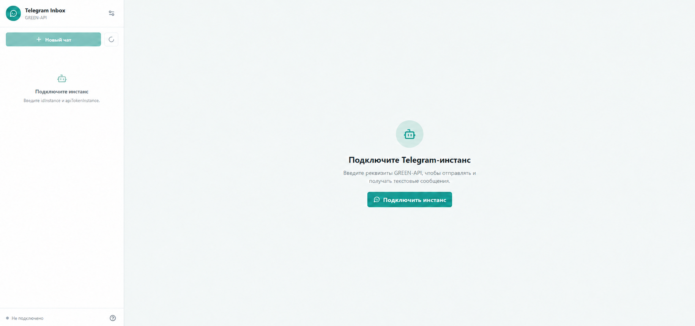
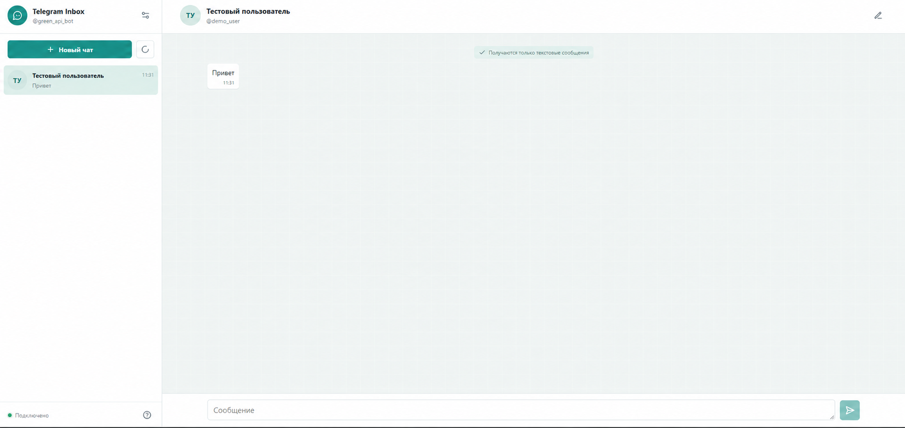

# Telegram Inbox via GREEN-API

React + TypeScript интерфейс для отправки и получения текстовых сообщений в Telegram через GREEN-API HTTP API.

**Демо:** https://telegram-inbox.telegram-chat-console.workers.dev

## Скриншоты

### Подключение бота



### Переписка



## Возможности

- Подключение по `idInstance` и `apiTokenInstance` GREEN-API.
- Проверка авторизации Telegram-инстанса через `getStateInstance`.
- Получение текстовых сообщений через `receiveNotification` и подтверждение `deleteNotification`.
- TanStack Query для кэша API, polling и мутаций.
- Список чатов, сформированный из входящих сообщений.
- Отправка текста через `sendMessage`.
- Ручное открытие чата по `chatId`.

## Запуск

1. Установите Node.js 20+.
2. Выполните `npm install`.
3. Выполните `npm run dev`.
4. Откройте адрес Vite из терминала, обычно `http://localhost:5173`.

## Как протестировать

1. Создайте Telegram-инстанс в личном кабинете GREEN-API и авторизуйте его.
2. Введите `idInstance` и `apiTokenInstance` в настройках приложения.
3. Убедитесь, что для инстанса включены входящие уведомления и не задан `webhookUrl`.
4. Отправьте текстовое сообщение в Telegram и нажмите кнопку обновления. Чат появится в боковой панели.
5. Выберите чат и отправьте ответ.

Приложение работает с текстовыми уведомлениями GREEN-API. Очередь уведомлений FIFO: каждое обработанное уведомление подтверждается методом `deleteNotification`.

`apiTokenInstance` передаётся только при подключении и хранится в памяти backend-а. Браузер использует `HttpOnly` session-cookie и не сохраняет ключ в `sessionStorage`. Сессия действует до восьми часов и будет сброшена при перезапуске backend-контейнера.

При обновлении вкладки сохраняются выбранный чат, полученные сообщения и курсор Telegram updates. Данные существуют только до закрытия вкладки.

## Структура

Проект организован по Feature-Sliced Design:

- `app` - точка входа приложения;
- `pages/chat` - композиция экрана чата и его состояние;
- `widgets` - боковая панель и окно переписки;
- `features` - подключение бота и ручное добавление чата;
- `entities` - типы, API-query и чистые операции с чатами и сообщениями;
- `shared` - API-клиент, Query Client и работа с session storage.

## Backend

Сервер организован по clean architecture:

- `server/app` - композиция Express-приложения;
- `server/config` - конфигурация запуска;
- `server/modules/telegram/domain` - независимые от HTTP контракты мессенджера и GREEN-API;
- `server/modules/telegram/application` - валидация реквизитов и use cases;
- `server/modules/telegram/infrastructure` - HTTP-шлюз к GREEN-API;
- `server/modules/telegram/presentation` - Express-маршруты `/api/green-api/*`;
- `server/shared` - обработка ошибок и HTTP-утилиты.

Проверки: `npm run typecheck`, `npm test`, `npm run build`.

## Docker и Nginx

Для production-запуска используются два контейнера: Nginx со статической React-сборкой и Node.js API. Nginx принимает внешний трафик, отдаёт SPA и проксирует `/api/*` во внутренний backend-контейнер.

```bash
docker compose up --build
```

Приложение будет доступно по адресу `http://localhost:8080`. Backend наружу не публикуется.

Для инфраструктурной проверки без токена доступен `GET /api/health` через Nginx.

## Cloudflare Workers

Для бесплатного внешнего запуска проект можно развернуть как один Cloudflare Worker: он отдаёт React-сборку и обслуживает API. Сессии Telegram сохраняются в SQLite-backed Durable Object, поэтому не зависят от жизненного цикла отдельного процесса.

1. Создайте бесплатный аккаунт Cloudflare.
2. Выполните `npx wrangler login` и подтвердите доступ в браузере.
3. Выполните `npm run deploy:cloudflare`.

После публикации Wrangler выведет постоянный адрес вида `https://telegram-inbox.telegram-chat-console.workers.dev/`.
